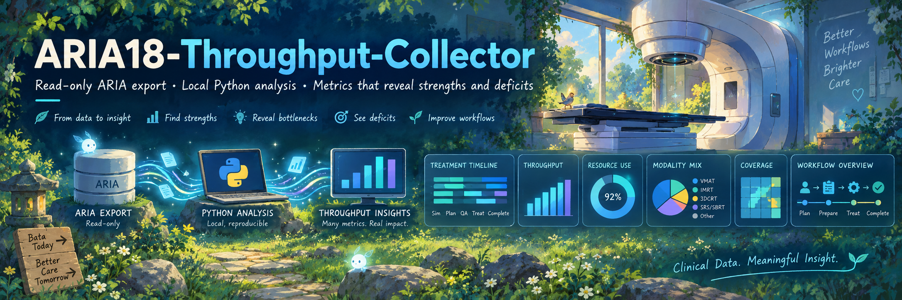

# ARIA Performance-Analyse

Dieses Projekt verbindet einen rein lesenden ARIA-Export mit einer lokalen
Python-Auswertung. Es hilft strahlentherapeutischen Einrichtungen, gebuchte
Gerätezeiten, dokumentierte Behandlungsabläufe und Datenlücken nachvollziehbar
zu untersuchen. Gemeinsame Definitionen sollen anschließend belastbare
Standortvergleiche ermöglichen, keine unbereinigten Ranglisten.

## Aktueller Stand

**Version 2.0.0-rc.5** ist der aktuelle Pilot-/Releasekandidat zur Vorbereitung
eines Projekts der AG Digitalisierung. Technische Tests an einem Pilotstandort
sind erfolgt; eine gemeinsame fachliche Multistandortabnahme steht noch aus.
Die Software ist nicht klinisch freigegeben.

**[Gesamtpaket herunterladen](https://github.com/Kiragroh/ARIA18-Throughput-Collector/releases/download/v2.0.0-rc.5/ARIA-Performance_Gesamtpaket.zip)**
| [Prüfstatus](docs/v2/VALIDIERUNG.md)
| [Änderungen](CHANGELOG.md)

Zwei Ordner: **Durchfuehrung** mit RDL, Offline-Formular und Anleitung;
**Analyse** mit Python-Skript, Standortprofilen, Methodik und synthetischem Probelauf.

**[Nur Durchführung herunterladen](https://github.com/Kiragroh/ARIA18-Throughput-Collector/releases/download/v2.0.0-rc.5/ARIA-Performance_Durchfuehrung.zip)**:
dieselben Durchführungsdateien ohne Analyse-Skripte. Start in beiden Paketen:
`Durchfuehrung/START_HIER.html`. Für die Einreichung ist Python nicht nötig.

Gemeinsamer Jahreszeitraum: **1. Januar bis 31. Dezember 2025**.
Ein anderes möglichst aktuelles, vollständiges Jahr ist möglich; lokale
Besonderheiten können kurz erläutert werden. Für einen Probelauf reichen Januar/Februar 2025.

## Sie möchten mitmachen?

Im **[Ordner kooperation](kooperation/README.md)** stehen die Projektidee,
der Nutzen für Ihren Standort und alle Schritte zur Teilnahme: gemeinsamer
Report, JSON-Standortformular, eindeutige Dateibenennung und Upload-Hinweise.

Die **[kurze Präsentation](https://kiragroh.github.io/ARIA18-Throughput-Collector/)**
erklärt den Einstieg und enthält QR-Codes zur Projektseite und zum Upload.
Für die erste Einreichung benötigen Sie noch keine Python-Installation.
Der **Full Collector XLSX enthält Auswertungsdaten und integrierte
Preflight-/Diagnoseabfragen**. Kein separater Preflight und kein Umschalten.
Er kann direkt funktionieren; bei Unstimmigkeiten helfen die Prüftabellen
zusammen mit dem kurzen Formular, lokale Konventionen zu klären und den
Report zu verbessern. Nur Standort und Auswertungszeitraum werden angezeigt.
**Für die Einreichung brauchen wir die Full-Collector-Exceldatei und die JSON.**
Das Formular funktioniert offline und bietet nur „JSON herunterladen“;
optionale Angaben dürfen leer bleiben. Beide Dateien gemeinsam als ZIP einreichen.
Falls bekannt, kann die Patientenzahl 2025 mit Zählweise und Quelle ergänzt werden.
Sie dient als unabhängiger Plausibilitätsabgleich, nicht als Ersatz für den Export.
Pseudonymisierte Detaildateien nur mit lokaler Freigabe im geschützten
Projektbereich verarbeiten, niemals auf GitHub veröffentlichen.
[ARIA-Import, Report Builder und anonymisiertes Excel-URL-Beispiel für 2025](kooperation/RDL_AUSFUEHREN.md).

Die über den dort verlinkten Upload eingereichten Dateien sind ausschließlich
für **Maximilian Grohmann** freigegeben. Er erhält Upload-Benachrichtigungen,
prüft die Einreichungen und kann sich über die dienstliche Kontaktadresse im
Begleitbogen bei Rückfragen melden. Andere Teilnehmende haben keinen Zugriff
auf Ihre Einreichung. Nur lokal geprüfte und freigegebene Unterlagen hochladen,
keine Namen, Original-IDs oder Freitextnotizen ergänzen.

## Einstieg am Standort

1. **Gemeinsamer Report:** Den Full Collector aus dem Ordner `Durchfuehrung`
   importieren, mit der lokalen ARIA-DWH-Datenquelle verbinden und als Excel
   exportieren. Auswertungsdaten, Schema, Geräte, Terminarten, Statuswerte,
   Abschlussdiagnostik und Versionshinweise stehen in derselben Exceldatei.
2. **Zuordnung bestätigen:** Das
   [Standortformular und den Testablauf](docs/v2/STANDORTTEST.md) verwenden.
   Auch Brachy und historische Geräte ohne technischen R&V-Nachweis berücksichtigen.
3. **Lokal auswerten:** Die Exceldatei mit der
   [Python-Auswertung](docs/v2/START.md) verarbeiten.
   Für große Datenmengen steht zusätzlich ein
   [Fast-CSV-Collector](dist/ARIA18_Throughput_Collector_Fast_2.0.rdl) bereit.
   Der interaktive HTML-Bericht funktioniert anschließend ohne Internet.

## Was die Auswertung zeigt

- Kalenderslots, dokumentierte Behandlungsintervalle und deren tatsächliche Überlappung.
- Zeitverteilungen, Patientenwechsel und freie Gerätezeit mit Messabdeckung.
- Aufklärungsepisoden, mehrfache Termine, folgende Therapie und weitere Beobachtung.
- Quellenlücken und unklare Zuordnungen, damit fehlende Daten nicht als Nullwerte erscheinen.

Aktivität ist das Standard-Zeitmodell. Workflow und Imaging/Beam werden getrennt
ausgewiesen. Kalenderdauer ersetzt keine gemessene Dauer; eine Datenlücke ist
keine nachgewiesene Pause. Für eine negative Einstufung einer Aufklärungsepisode
sind mindestens drei Kalendermonate Nachbeobachtung erforderlich. Die Suche nach
späterer Behandlung oder Wiedervorstellung endet dadurch nicht nach drei Monaten.

## Voraussetzungen und Grenzen

**Bisher gegen ARIA 18 geprüft.** Andere ARIA-Versionen sind nicht bestätigt.
`VersionInfo` nennt diesen Prüfstand und die SQL-Server-Version getrennt.
Eine nicht verlässlich auslesbare installierte ARIA-Version wird als unbekannt
gekennzeichnet und kann optional im Formular ergänzt werden.

Benötigt werden ARIA-DWH, lesender SSRS-Zugriff und eine fachlich bestätigte
Zuordnung der lokalen Geräte und Aktivitäten. Therapie ohne technisches R&V
kann über eindeutig zugeordnete abgeschlossene Therapietermine belegt werden;
technische Beam-Zeiten werden daraus nicht abgeleitet. Fehlende Quellen brauchen
eine gekennzeichnete Einschränkung oder einen eigenen Adapter.

Die Abfragen verändern keine ARIA-Daten. Detaildateien sind pseudonymisiert,
nicht anonym: lokal auswerten oder nach lokaler Freigabe ausschließlich im
geschützten Projektbereich bereitstellen. Öffentlich nur geprüfte Aggregate;
auch Aggregate sind nicht automatisch anonym.
Keine klinischen Dateien in GitHub-Issues oder Pull Requests einstellen.
Das Projekt dient Analyse und Forschung, nicht der Behandlung einzelner Patienten.

## Dokumentation

- [Projektidee und Analyseplan](docs/v2/AG_PROJEKT.md)
- [Standorttest und minimale Anpassungen](docs/v2/STANDORTTEST.md)
- [Methodik, Zähler und Nenner](docs/v2/METHODIK.md)
- [Lokale Installation und Auswertung](docs/v2/START.md)
- [Bildgebung: Quellen und noch offene Adapter](docs/v2/IMAGING.md)

Frühere Stände bleiben in der
[Versionshistorie](https://github.com/Kiragroh/ARIA18-Throughput-Collector/releases)
nachvollziehbar. Für neue Teilnahmen gilt ausschließlich der oben verlinkte Stand.
